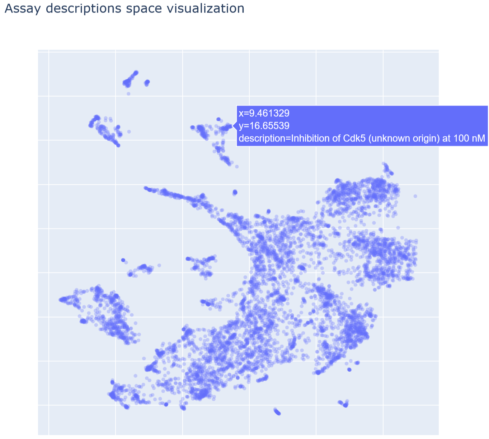

# Fine-Tuning BioLinkBERT for Named Entity Recognition (NER) on Biochemical Assay Descriptions

This project focuses on fine-tuning the BioLinkBERT-base model for Named Entity Recognition (NER) on a custom dataset of biochemical assay descriptions extracted from the ChEMBL database. The goal is to identify and extract key entities such as target names and substrate names from experimental descriptions.

Variety of assay descriptions is visualized below:

To create the dataset, **meta-llama/Llama-3-70B-Instruct** was used for preliminary annotation. The model was provided with a few-shot instruction consisting of seven handcrafted examples. Each example demonstrated how to extract target names and substrate names from various assay descriptions.

The outputs from Llama-3 were post-processed into a format suitable for NER, where each token in the text was labeled with one of the following:
- `B-TARGET`, `I-TARGET` for target names.
- `B-SUBSTRATE`, `I-SUBSTRATE` for substrate names.
- `O` for tokens not part of any entity.

**BioLinkBERT-base** model was chosen for fine-tuning due to its superior performance on biomedical text tasks. BioLinkBERT is pre-trained on a large corpus of biomedical literature and achieves state-of-the-art results on benchmarks like **BLURB**.

The fine-tuned model achieved the following results on the test set:

| Metric     | Score       |
|------------|-------------|
| Precision  | 0.9423      |
| Recall     | 0.8899      |
| F1 Score   | 0.9153      |
| Accuracy   | 0.9841      |

These metrics demonstrate the model's ability to accurately identify and extract target and substrate names from assay descriptions.

Example of model evaluation on random assay description from ChEMBL is shown below:

